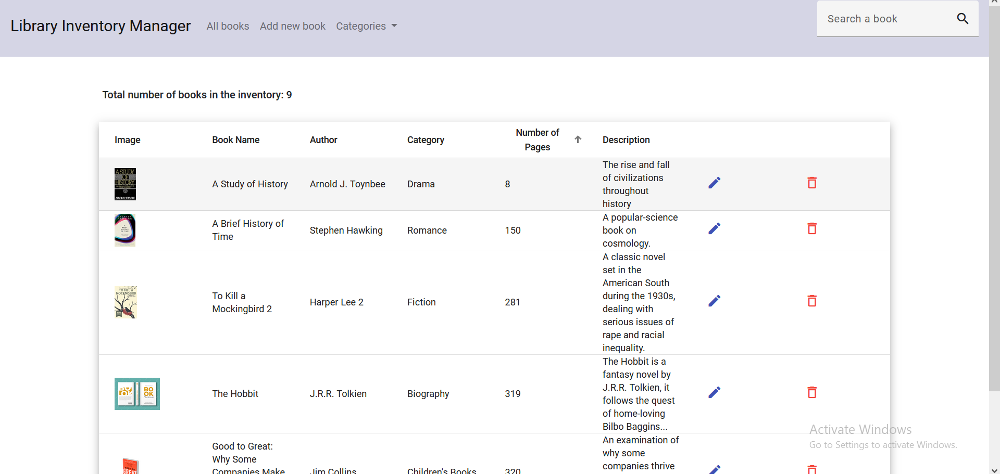

# LibraryInventoryManager

This project is designed for managing library books, especially helpful for librarians to manage and keep track of the books in the library. 
- Using Angular fronend and Angular Material.
- My SpringBoot repository for backend, [click here.](https://github.com/katjaprodanova/library-inventory-manager-backend)

### Running the application
- Application runs on port 4200.
  -  Run SpringBoot backend.
  -  Run frontend by using `ng serve`in terminal.
  - Navigate to https://localhost:4200/ in your browser to use the app.

### Main page 
 - 
### Adding a book
- 
- All fields are required. If the user leaves a blank field, it turns red
### Sorting
- 
- We can click on the 'Number of pages' header, and it sorts our books, by ascending, or descending order. 
- On the picture above, I intentionally made the book's number of pages very low (8), so we can see the book pop up first when we sort them.
- The sorting works for Book Name, Author, Category and Number of pages. It is disabled for the other fields.
### Search a book
- 
- Searching by keyword "Hist", it gives us the 2 books that include it in their book title.
- 
- Searching by keyword "Hist", it gives us the 2 books that include it in their book title.
### Pagination
- 
- Choose how many books per page to be displayed.
### Delete 
- 
### Edit book
- 

